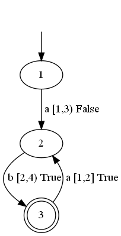

# DOTALearningSMT
Active learning of deterministic one-clock timed automata using constraint solving.

## About
This tool implements an algorithm which can perform efficiently active learning of deterministic one-clock timed automata (DOTA) with the help of SMT solver [Z3](https://github.com/Z3Prover/z3). 
- A DOTA is a finite automation extended with one clock, e.g. the following figure is a two state DOTA.
- This is an Angluin-style active learning algorithm, e.g. the DOTA is learned using membership query and equivalence query.


## Installation
This tool is implemented in pure Python language. To use our tool, you may need to install:
- [Python](https://www.python.org/downloads/) version >= 3.8.10
- [Python wrapper for Z3](https://github.com/z3prover/z3#python) (through pip): `python -m pip install z3-solver`

Recommended: To better understand the learning process, our tool also supports to visualize the original DOTA and the learned DOTA. If you want to use this feature, please install [Graphviz](https://graphviz.org/download/) and its Python binding: `python -m pip install graphviz` 

(Note: Make sure you have set the bin folder of Graphviz in the environment `PATH` variable)

## The representation of a DOTA
We use JSON format to decribe DOTAs, for example, the following is `a.json` in folder <a href="/examples/DOTA">examples/DOTA</a> and its correponding DOTA (generated by Graphviz). To define a DOTA, we need six keywords, "name" gives DOTA a name, "l" stores all the states' name in the DOTA, such as in `a.json`, there are three states `1,2,3`, "sigma" is the alphabet of this automation, "tran" collects all the transitions, for instance, in `"2": ["3", "a", "[1,2]", "r", "2"]` is a transition from `3` to `2` when there is an action `a` occurs in clock value $\nu\in [1,2]$, `r` means after the transition, the clock value will be reset to zero (`n` denotes non-reset after transition, such as transition "0"). "init" sets the initial state of DOTA, and "accept" sets the accepting states of DOTA.
```
{
    "name": "A",
    "l": ["1", "2", "3"],
	"sigma": ["a", "b"],
	"tran": {
		"0": ["1", "a", "[1,3)", "n", "2"],
		"1": ["2", "b", "[2,4)", "r", "3"],
		"2": ["3", "a", "[1,2]", "r", "2"]
	},
	"init": "1",
	"accept": ["3"]
}

```


You can define any DOTA through this way, but make sure that the OTA you defined is deterministic.

## How to use
### DOTA
If you have already written a DOTA in JSON format and stored it in the path `file_path`, you can type this command: `python run_dota.py file_path`, `file_path` is the path of the file you want to run.

Example: `python3 run_dota_file.py examples/DOTA/a.json` would learn the DOTA in `a.json`.

If you also want to visualize the learning process of `a.json`, you can use this command: `python3 run_dota.py --graph=true`, the graph generated in each step can be found in `./dot/`

## Run tests
We use the unit testing framework `unittest` to test our tool, all the test files are stored in `./tests/`
### DOTA
To test the DOTA learning algorithm, you may use the command: `python -m unittest tests.smart_learner_test`, the results can be found in `./dota_output.txt`
### OCMM (Deterministic one-clock mealy machine)
To test the OCMM learning algorithm, you may use the command: `python -m unittest tests.ocmm_learner_test`, the results can be found in `./ocmm_output.txt`

## Benchmarks
#### Deterministic one-clock timed automata
The DOTA benchmarks can be found in ./example/DOTA.
If you are using a Linux system, you can also use the shell script `run_dota.sh` to run multiple files, for instance, the command `./run_dota.sh 3_2_10` would run all the JSON files stored in `examples/DOTA/3_2_10`, the statistics can be found in the file `result/3_2_10.txt`.

#### Deterministic one-clock mealy machine
The OCMM benchmarks can be found in ./example/MMT/OCMMs

To test the one-clock mealy machine benchmarks in Linux system, you may use the following command if you are using Linux system

`./run_ocmm.sh`

The experimental results are stored in `./result/OCMMs.txt`

